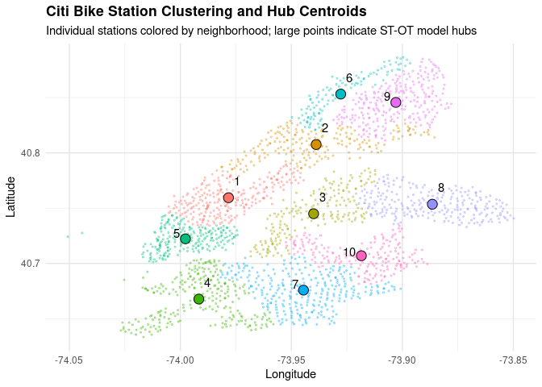
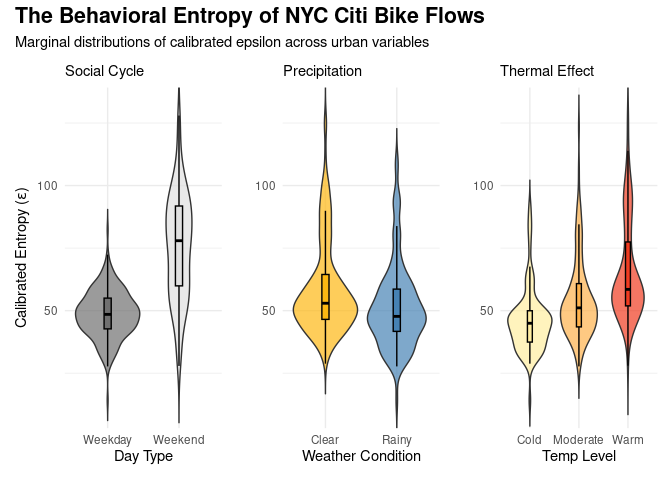
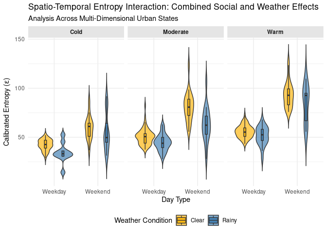

Discovering Urban Mobility Patterns through Spatio-Temporal Optimal
Transport and Behavioral Calibration
================
Maria Osipenko, Fanqi Meng
2026-03-24

## Load the Data

``` r
#Load trips data
load("cbdata.Rdata") # cleaned citibike-tripdata for 2024 from (https://s3.amazonaws.com/tripdata/index.html
load("cbdata25.Rdata") # cleaned citibike-tripdata for 2025 from (https://s3.amazonaws.com/tripdata/index.html

#Remove the trips with the same ODs
raw_data = cbdata[cbdata$start_station_id != cbdata$end_station_id,] 
raw_data25 = cbdata25[cbdata25$start_station_id != cbdata25$end_station_id,] 

#Extract unique stations
stations <- raw_data %>%
  select(station_id = start_station_id, lat = start_lat, lon = start_lng) %>%
  distinct(station_id, .keep_all = TRUE) %>%
  drop_na()

#Load weather data
load("wdata.Rdata") # daily weather data for 2025 in NYC central park weather station from https://www.ncei.noaa.gov/access/search/data-search/daily-summaries
```

## Define the Functions

``` r
############################################# Load helper functions
source("functions.R")

############################################# Define specific OT functions
############################################## COST
compute_cost <- function(C_spatial_informed, st_grid, gamma = 1){
  n_nodes <- nrow(st_grid)
  C_st <- matrix(Inf, n_nodes, n_nodes)
  # Fill C_st using our 10x10 OSRM neighborhood travel times
  for(r in 1:n_nodes) {
    for(c in 1:n_nodes) {
      # Causal constraint: can't travel backward in time
      if(st_grid$Time[c] >= st_grid$Time[r]) {
        orig <- st_grid$neighborhood_id[r]
        dest <- st_grid$neighborhood_id[c]
        
        # Use OSRM durations (assuming C_neighborhoods is in hours)
        travel_time <- C_spatial_informed[orig, dest]
        
        # Cost = Physical Travel Time + Temporal Penalty
        C_st[r,c] <- (travel_time) + 
                     (gamma * abs((st_grid$Time[c] - st_grid$Time[r]) - travel_time))
      }
    }
  }
  return(C_st)
}
############################################### Sinkhorn 
unbalanced_sinkhorn <- function(a, b, C, eps = 1, tau = 10, n_iter = 200) {
  a_mat <- matrix(as.numeric(a), ncol = 1)
  b_mat <- matrix(as.numeric(b), ncol = 1)
  C_mat <- as.matrix(C)
  
  if (nrow(C_mat) != nrow(a_mat) || ncol(C_mat) != nrow(b_mat)) stop("Dimension mismatch!")

  K <- exp(-C_mat / eps)
  K[is.nan(K) | is.na(K)] <- 0 
  u <- matrix(1, nrow = nrow(a_mat), ncol = 1)
  fi <- tau / (tau + eps)
  
  for (i in 1:n_iter) {
    Kv <- t(K) %*% u + 1e-10
    v <- (b_mat / Kv)^fi
    Ku <- K %*% v + 1e-10
    u <- (a_mat / Ku)^fi
  }
  
  P <- diag(as.vector(u)) %*% K %*% diag(as.vector(v))
  rownames(P) <- colnames(P) <- rownames(C_mat)
  return(P)
}

unbalanced_sinkhorn_with_prior <- function(a, b, C, Q, eps = 5, tau = 100) {
  # Incorporate the Prior
  K <- Q * exp(-as.matrix(C) / eps)
  
  # Standard Sinkhorn
  u <- rep(1, length(a))
  fi <- tau / (tau + eps)
  
  for (i in 1:100) {
    v <- (b / (as.vector(t(K) %*% u) + 1e-10))^fi
    u <- (a / (as.vector(K %*% v) + 1e-10))^fi
  }
  
  return(sweep(sweep(K, 1, u, "*"), 2, v, "*"))
}

compute_plan <- function(st_grid, C_st, prior = FALSE, Q_prior = NULL, eps = 1, tau = 1000){
  if(prior){
    P_est <- unbalanced_sinkhorn_with_prior(st_grid$S, st_grid$D, C_st, Q = Q_prior, eps = eps, tau = tau)
  } else {
    P_est <- unbalanced_sinkhorn(st_grid$S, st_grid$D, C_st, eps = eps, tau = tau)
  }
  return(P_est)
}
```

## Spatial Aggregation

``` r
#Divide the 2000 stations into 100 candidate zones
set.seed(123)
pre_clusters <- kmeans(stations[, c("lon", "lat")], centers = 100)
stations$pre_group <- pre_clusters$cluster

#Get the center station of each candidate zone
candidate_centers <- stations %>%
  group_by(pre_group) %>%
  slice(1) %>% # Simply take the first station as a representative for the table
  ungroup()

#Get a 100x100 travel time matrix
dist_matrix_osrm <- osrmTable(
  src = candidate_centers[, c("lon", "lat")],
  dst = candidate_centers[, c("lon", "lat")],
  measure = "duration",
  osrm.profile = "bike"
)

#Convert to a standard matrix
clean_dist_matrix <- dist_matrix_osrm$durations
rownames(clean_dist_matrix) = colnames(clean_dist_matrix) = candidate_centers$station_id

#Run PAM on the OSRM duration matrix
final_clusters_pam <- pam(clean_dist_matrix, k = 10, diss = TRUE)

#Extract neighborhoods = 10 clusters
neighborhood_lookup <- tibble(
  pre_group = candidate_centers$pre_group,
  neighborhood_id = final_clusters_pam$clustering
)

#Assigns stations to a neighborhood
stations_final <- stations %>%
  left_join(neighborhood_lookup, by = "pre_group")

#Calculate the average lat/lon of each cluster
neighborhood_centroids <- stations_final %>%
  group_by(neighborhood_id) %>%
  summarize(
    lat = mean(lat),
    lon = mean(lon),
    station_count = n()
  )

#Get the 10x10 OSRM travel time matrix for the neighborhoods
final_osrm_table <- osrmTable(
  src = neighborhood_centroids[, c("lon", "lat")],
  dst = neighborhood_centroids[, c("lon", "lat")],
  measure = "duration",
  osrm.profile = "bike"
)

C_neighborhoods <- final_osrm_table$durations / 60 # Convert to hours
rownames(C_neighborhoods) = colnames(C_neighborhoods) = neighborhood_centroids$neighborhood_id

#Correct for the inner-zone trips
C_spatial_informed <- C_neighborhoods

#Apply the neightbor heuristic to the diagonal
for(i in 1:nrow(C_spatial_informed)) {
  # Extract all costs from neighborhood i to others 
  inter_zonal_costs <- C_spatial_informed[i, -i]
  
  # Set the internal cost to half of the closest neighbor's cost
  C_spatial_informed[i, i] <- 0.5 * min(inter_zonal_costs)
}


# Create the map visualization
ggplot() +
  # Layer 1: Individual Stations
   geom_point(data = stations_final, 
             aes(x = lon, y = lat, color = as.factor(neighborhood_id)), 
             alpha = 0.3, size = 0.5) +
  
  # Layer 2: Neighborhood Centroids
  geom_point(data = neighborhood_centroids, 
             aes(x = lon, y = lat, fill = as.factor(neighborhood_id)), 
             size = 4, shape = 21, color = "black", stroke = 0.5) +
  geom_text_repel(data = neighborhood_centroids, aes(x = lon, y = lat+0.01, label = neighborhood_id)) +
 
  theme_minimal() +
  scale_color_discrete(name = "Neighborhood") +
  scale_fill_discrete(guide = "none") + # Hide redundant fill legend
  labs(title = "Citi Bike Station Clustering and Hub Centroids",
       subtitle = "Individual stations colored by neighborhood; large points indicate ST-OT model hubs",
       x = "Longitude", y = "Latitude") +
  theme(#legend.position = "right",
    legend.position = "none",
        panel.grid.major = element_line(color = "grey90"),
        plot.title = element_text(face = "bold"))
```

<!-- -->

## Temporal Aggregation and Optimization

``` r
## Temporal aggregation: runs slowly
# months = c(paste0("0",1:9), 10:12)
# for(m in 2:length(months)){
#   print(months[m])
#   ######################################################## DATA #########################
#   csvf = list.files(paste0("data/2024", months[m],"-citibike-tripdata/"), full.names = T)
#   raw_data = NULL
#   for(i in 1:length(csvf)){
#     raw_data = rbind(raw_data, read.csv(csvf[i],header=T))
#   }
#   csvf = list.files(paste0("data/2025", months[m],"-citibike-tripdata/"), full.names = T)
#   raw_data25 = NULL
#   for(i in 1:length(csvf)){
#     raw_data25 = rbind(raw_data25, read.csv(csvf[i],header=T))
#   }
#   #preprocess
#   data_pro = process_data_wd(raw_data)
#   data_pro25 = process_data_doy(raw_data25)
#   ##################################################### HABITS ##########################
#   st_grid_wd = list()
#   #wd
#   for (wd in 0:6){
#     st_grid_wd[[wd+1]] <- data_pro$st_grid[grepl(paste0("_",wd), data_pro$st_grid$Node_ID),]
#   }
#   Q_prior_wd = list()
#   for(wd in 0:6){
#     n_nodes <- nrow(st_grid_wd[[wd+1]])
#     node_lookup <- setNames(1:n_nodes, st_grid_wd[[wd+1]]$Node_ID)
#     Q_prior <- matrix(0, nrow = n_nodes, ncol = n_nodes)
#     st_counts <- data_pro$trips_mapped[data_pro$trips_mapped$wd == wd,] %>%
#       mutate(
#         from_node = paste0(start_neigh, "_T", T_Start, "_",wd),
#         to_node = paste0(end_neigh, "_T", T_End, "_",wd)
#       ) %>%
#       count(from_node, to_node)
#     #  Fill the matrix
#     for(i in 1:nrow(st_counts)) {
#       row_idx <- node_lookup[st_counts$from_node[i]]
#       col_idx <- node_lookup[st_counts$to_node[i]]
#       
#       # Only fill if the nodes exist in our study grid
#       if(!is.na(row_idx) & !is.na(col_idx)) {
#         Q_prior[row_idx, col_idx] <- st_counts$n[i]
#       }
#     }
#     # Assign names from your grid to the matrix
#     rownames(Q_prior) <- colnames(Q_prior) <- st_grid_wd[[wd+1]]$Node_ID
#     Q_prior_wd[[wd+1]] <- Q_prior
#   }
#   ######################################################## GRID SEARCH #####################
#   best_pars = metrics = NULL
#   for(d in data_pro25$doy){
#     #print(d)
#     opt_pars = choose_best_eps(eps_min = 0, eps_max = 10000, 
#                             st_grid_d = data_pro25$st_grid[data_pro25$st_grid$doy==d,],
#                             trips_mapped_d=data_pro25$trips_mapped[data_pro25$trips_mapped$doy==d,], 
#                             C_spatial_informed, prior, Q_prior_wd)
#     best_pars = cbind(best_pars, opt_pars$best_params)
#     metrics = cbind(metrics, opt_pars$metrics)
# 
#    #cat("\14")
#   }
#   df_best = data.frame(t(best_pars), doy = data_pro25$doy, wd = data_pro25$wd, t(metrics))
#   colnames(df_best)[c(1:3,6:8)] = c("epsilon", "phi", "gamma","RMSE","MAE","CRC")
#   
#   save(df_best, file=paste0("results/df_best_",months[m], ".RData"))
#   cat("\14")
# }
#   ###################################################### COMBINE ###########################
# mholidays = as.Date(c("2025-01-01","2025-05-26","2025-07-04","2025-01-20","2025-02-12","2025-02-17",
#                       "2025-06-19","2025-09-01","2025-10-13","2025-11-11","2025-11-27"))
# 
# months = c(paste0("0",1:9), 10:12)
# df_best_all = month = NULL
# 
# ff = list.files("../results/", full.names = T)
#
# for (f in 1:length(ff)){
#   load(ff[f])
#   dates = as.Date(df_best$doy, origin = "2024-12-31")
#   ind = substr(dates,6,7) ==substr(ff[f],18,19)
#   dff = df_best#[ind,]
#   df_best_all = rbind(df_best_all, cbind(dff, is_holiday =  dates%in%mholidays, date = dates))
# }
# #dim(df_best_all)
# 
# df_best_all = df_best_all[!duplicated(df_best_all$date),]
# save(df_best_all, file="df_best_all.RData)
```

``` r
# Load and merge with the weather data
load("df_best_all.RData")
df_best_all_w = merge(df_best_all, wdata[,c("PRCP","TMIN","TMAX","DATE")], by.y= "DATE", by.x = "date", all.x=T)
df_best_all_w$Daily_Temp = 0.5*(df_best_all_w$TMIN + df_best_all_w$TMAX)
df_best_all_w$Is_Rainy = df_best_all_w$PRCP>0 
df_best_all_w$Is_Weekend = df_best_all$wd%in%c(0,6)
```

## Results

<div class="figure">


<p class="caption">
Violin plots of the distributions of the obtained $\epsilon^*_t$ values
for different influence variables such as the social cycle (left panel)
and weather conditions (precipitation: middle panel, temperature: right
panel).
</p>

</div>

<div class="figure">


<p class="caption">
Violin plots of the distributions of the obtained $\epsilon^*_t$ values
for weekdays versus weekend and for different combinations of weather
regimes, such as clear (orange color) or rainy (blue color) states, and
cold (left panel), moderate (moiddle panel), warm (right panel)
temperature regimes.
</p>

</div>

## Statistical Validation

``` r
# Wilcoxon rank sum test
weekday_eps <- df_best_all_w$epsilon[!df_best_all_w$Is_Weekend]
weekend_eps <- df_best_all_w$epsilon[df_best_all_w$Is_Weekend]
wilcox_test <- wilcox.test(weekday_eps, weekend_eps)
print(wilcox_test)
```

    ## 
    ##  Wilcoxon rank sum test with continuity correction
    ## 
    ## data:  weekday_eps and weekend_eps
    ## W = 3558, p-value < 2.2e-16
    ## alternative hypothesis: true location shift is not equal to 0

``` r
# Permutation test
perm_test <- independence_test(epsilon ~ as.factor(Is_Weekend), 
                               data = df_best_all_w, 
                               distribution = "approximate")
pvalue(perm_test)
```

    ## [1] <1e-04
    ## 99 percent confidence interval:
    ##  0.0000000000 0.0005296914

``` r
#Interaction model
interaction_model <- lm(epsilon ~ Is_Weekend+ Is_Rainy + Daily_Temp + Is_Weekend * Is_Rainy + Is_Weekend * Daily_Temp,
                        data = df_best_all_w)

#Calculate Newey-West robust standard errors
robust_cov <- NeweyWest(interaction_model, lag = NULL, prewhite = FALSE)
#Apply the robust covariance to your model summary
robust_summary <- coeftest(interaction_model, vcov = robust_cov)
#Transform to a tidy kable table
beta_labels <- c(
  "$\\beta_0$ (Intercept)",
  "$\\beta_1$ (Weekend)",
  "$\\beta_2$ (Rainy)",
  "$\\beta_3$ (Temp)",
  "$\\beta_4$ (Weekend$\\cdot$Rainy)",
  "$\\beta_{5}$ (Weekend$\\cdot$Temp)"
)
robust_summary = tidy(robust_summary) %>%
  mutate(term = beta_labels) 
kable(robust_summary[,c(1,2,5)],digits = 3, caption = "The estimation results of the linear interaction model in (2) with HAC standard errors for $p$-values computation.", escape=F)
```

| term                             | estimate | p.value |
|:---------------------------------|---------:|--------:|
| $\beta_0$ (Intercept)            |   43.456 |   0.000 |
| $\beta_1$ (Weekend)              |   19.205 |   0.000 |
| $\beta_2$ (Rainy)                |   -5.718 |   0.000 |
| $\beta_3$ (Temp)                 |    0.054 |   0.000 |
| $\beta_4$ (Weekend$\cdot$Rainy)  |   -6.548 |   0.082 |
| $\beta_{5}$ (Weekend$\cdot$Temp) |    0.077 |   0.000 |

The estimation results of the linear interaction model in (2) with HAC
standard errors for $p$-values computation.
